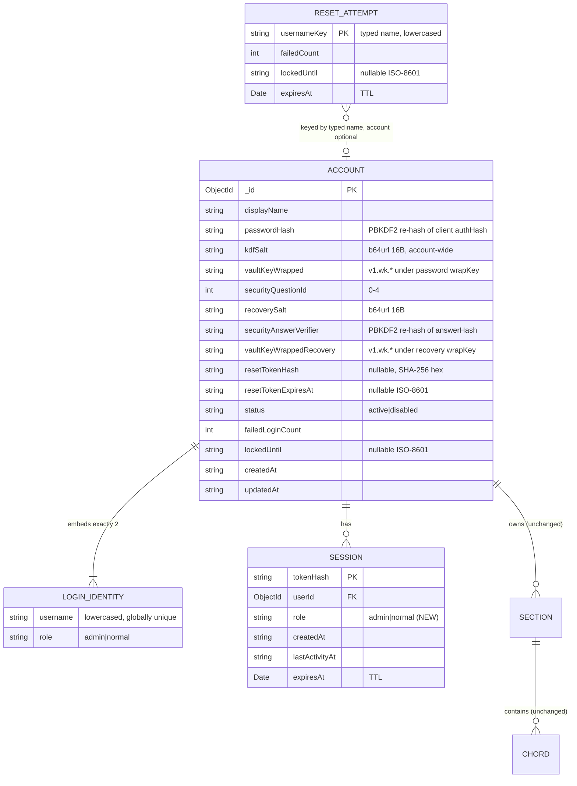

# Data Model: Dual Usernames with Roles & Security-Question Password Reset

**Feature**: specs/011-dual-user-roles | **Date**: 2026-07-13
**Sources**: spec.md Key Entities + research.md Decisions 1–6

## Entity Overview



## `users` collection — reshaped `UserDoc` (account)

One document per **account**. The `_id` remains the `userId` referenced by
`sessions.userId`, `sections.userId`, `chords.userId`, and by the L2 encryption salt
(feature 010) — untouched.

| Field | Type | Rules / Notes |
|---|---|---|
| `logins` | `{ username: string; role: 'admin' \| 'normal' }[]` | Exactly 2 entries, one per role. Usernames trimmed + lowercased, `^[a-z0-9]+$`, 3–30 chars, must differ from each other (validated at the boundary). **Unique multikey index** enforces global uniqueness across all accounts/roles (FR-003). |
| `displayName` | `string` | 1–100 chars. One per account (spec Assumption). |
| `passwordHash` | `string` | Encoded PBKDF2 hash of the client-derived `authHash`. UNCHANGED pipeline (`lib/password.ts`). One per account (FR-002). |
| `kdfSalt` | `string` | Client-generated, base64url 16 bytes. Served by the salt endpoint for **either** username. Replaced (fresh) on every reset. |
| `vaultKeyWrapped` | `string` | `v1.wk.<iv>.<ct>` — vault key under the password-derived wrap key. Replaced on reset (same vault key re-wrapped). |
| `securityQuestionId` | `number` | Integer 0–4, index into shared `SECURITY_QUESTIONS` (FR-013). Immutable post-registration (no change flow in scope). |
| `recoverySalt` | `string` | Client-generated, base64url 16 bytes. Salt for the answer KDF. Served by `reset/question` (decoy for non-admin/unknown names). |
| `securityAnswerVerifier` | `string` | PBKDF2 re-hash (same `hashPassword`) of the client-derived `answerHash`. Never returned to clients (FR-009). |
| `vaultKeyWrappedRecovery` | `string` | `v1.wk.<iv>.<ct>` — the SAME vault key under the answer-derived recovery wrap key. Returned ONLY by a successful `reset/verify`. NOT touched by reset (FR-011). |
| `resetTokenHash` | `string \| null` | SHA-256 hex of the outstanding one-time reset token; `null` when none. Set by `verify`, burned by `complete` / expiry. |
| `resetTokenExpiresAt` | `string \| null` | ISO-8601; 10 minutes after issuance. |
| `status` | `'active' \| 'disabled'` | Unchanged. |
| `failedLoginCount` / `lockedUntil` | `number` / `string \| null` | Unchanged login lockout (5 attempts / 15 min). |
| `createdAt` / `updatedAt` | `string` | ISO-8601. |

**Indexes**:
- `{ 'logins.username': 1 }` **unique** (multikey — global username uniqueness, replaces the old `{ username: 1 }` unique index)

**Removed fields** (vs feature 010 shape): top-level `username` (replaced by `logins`).

### Validation rules (Zod, at the API boundary)

- `adminUsername`, `username`: trim → lowercase → `^[a-z0-9]+$`, 3–30. Cross-field:
  `adminUsername !== username` after normalization → 400 `usernames_identical`
  ("Admin username and username must be different.").
- `displayName`: trim, 1–100.
- `securityQuestionId`: integer 0–4.
- `authHash`, `answerHash`: base64url, 43 chars (256 bits) — same rule as 010.
- `kdfSalt`, `recoverySalt`: base64url, 22 chars (128 bits).
- `vaultKeyWrapped`, `vaultKeyWrappedRecovery`: `^v1\.wk\.[A-Za-z0-9_-]+\.[A-Za-z0-9_-]+$`.
- Duplicate username (either role, any account) → 409 `username_taken`
  ("This username is already taken." — role/account never disclosed).
- The password itself never reaches the server (3–10 policy enforced client-side at
  the form, exactly as in 010).
- Security answer: client normalizes `trim().toLowerCase()` + collapse inner
  whitespace BEFORE the KDF — this is what makes comparison case/whitespace-
  insensitive (FR-009); the server only ever sees the derived hash.

## `sessions` collection — `SessionDoc` (extended)

| Field | Type | Rules / Notes |
|---|---|---|
| `tokenHash` | `string` | Unchanged (unique). |
| `userId` | `ObjectId` | Unchanged — the account `_id`. |
| `role` | `'admin' \| 'normal'` | **NEW.** Fixed at creation from the username used to sign in (FR-004). Never mutated. |
| `createdAt` / `lastActivityAt` / `expiresAt` | unchanged | Sliding + absolute expiry, TTL index. |

**New service capability**: `revokeAllSessionsForUser(userId)` → `deleteMany({ userId })`
(FR-012, used by `reset/complete`). Existing `{ userId: 1 }` index covers it.

## `resetAttempts` collection — NEW

Throttles `reset/verify` per **typed username string**, so unknown names throttle
identically to real ones (FR-010, research Decision 5).

| Field | Type | Rules / Notes |
|---|---|---|
| `usernameKey` | `string` | The requested username, trimmed + lowercased. Unique index. |
| `failedCount` | `number` | Consecutive failed verifies. Reset on success (row deleted). |
| `lockedUntil` | `string \| null` | ISO-8601. Set when `failedCount` reaches 5 → 15 min lock → 429. |
| `expiresAt` | `Date` | TTL index (`expireAfterSeconds: 0`), e.g. now + 24 h — auto-purge. |

**Indexes**: `{ usernameKey: 1 }` unique; `{ expiresAt: 1 }` TTL.

## `sections` / `chords` collections — UNCHANGED shape

No field changes. Access change only: all mutating routes now additionally require
`session.role === 'admin'` (contracts/vault-authz.md). Reads unchanged for both roles.

## Shared types (`shared/types/index.ts`) — deltas

```ts
/** Role carried by a session, from the username used at sign-in. */
export type UserRole = 'admin' | 'normal';

/** PublicUser gains the session role + reflects the username used to sign in. */
export interface PublicUser {
  id: string;
  username: string;       // the username used for THIS session
  displayName: string;
  role: UserRole;         // NEW
}

/** Fixed product-wide security questions (FR-013); id = array index. */
export const SECURITY_QUESTIONS: readonly string[];

export interface RegisterRequest {
  adminUsername: string;          // NEW
  username: string;               // now the NORMAL username
  displayName: string;
  authHash: string;
  kdfSalt: string;
  vaultKeyWrapped: string;
  securityQuestionId: number;     // NEW (0–4)
  answerHash: string;             // NEW (recovery-auth branch)
  recoverySalt: string;           // NEW
  vaultKeyWrappedRecovery: string; // NEW
}

/** LoginRequest, AuthResponse, SaltResponse — UNCHANGED shapes
    (AuthResponse.user now carries `role`). */

export interface ResetQuestionRequest { username: string }
export interface ResetQuestionResponse { questionId: number; recoverySalt: string }

export interface ResetVerifyRequest { username: string; answerHash: string }
export interface ResetVerifyResponse { resetToken: string; vaultKeyWrappedRecovery: string }

export interface ResetCompleteRequest {
  username: string;
  resetToken: string;
  newAuthHash: string;
  newKdfSalt: string;
  newVaultKeyWrapped: string;
}
```

## Key/crypto material map (who can read what)

| Material | Lives | Decryptable by server? |
|---|---|---|
| Password | Browser memory only | Never sent |
| Security answer (plaintext) | Browser memory only | Never sent |
| `authHash` / `answerHash` | Wire → re-hashed → verifier | Not reversible; not replayable from DB |
| `kdfSalt` / `recoverySalt` | DB, public via endpoints | Non-secret |
| Vault key | Browser memory + IndexedDB (non-extractable) | Never |
| `vaultKeyWrapped` / `vaultKeyWrappedRecovery` | DB | Opaque without password / answer |
| Reset token | Wire once; SHA-256 in DB | Hash only, single-use, 10-min TTL |

## State transitions

### Password reset (account credential epoch)

```text
[active, no reset pending]
   │ POST reset/question (any name)          — no state change (read + decoy)
   │ POST reset/verify — WRONG answer        → resetAttempts.failedCount++ (5 → lock 15 min)
   │ POST reset/verify — correct answer      → resetTokenHash+expiry set (10 min), attempts row cleared
   ▼
[reset pending]
   │ POST reset/complete — valid token       → passwordHash+kdfSalt+vaultKeyWrapped replaced ATOMICALLY,
   │                                           resetToken burned, ALL sessions revoked (FR-012)
   │ token expiry (10 min)                   → back to [active, no reset pending]
   ▼
[active, new credential epoch]               — vaultKeyWrappedRecovery UNCHANGED (FR-011)
```

### Session role

`created(role fixed at sign-in) → active → revoked (logout | expiry | reset/complete)`.
Role never changes within a session; switching roles = sign out + sign in with the
other username.
