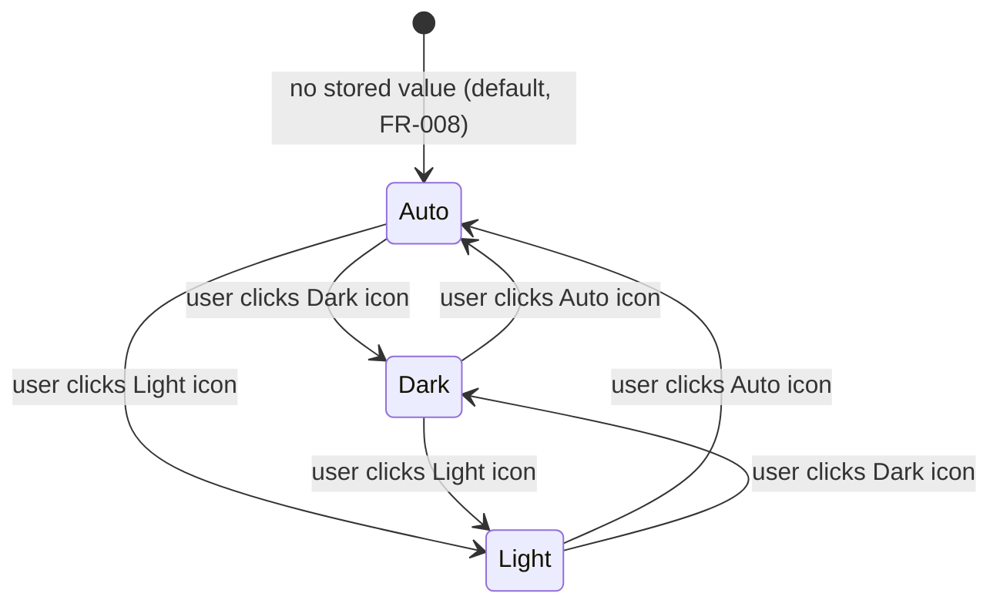

# Data Model: Theme Support (Auto / Dark / Light)

**Feature**: specs/013-theme-support | **Date**: 2026-07-14

This feature has **no server-side data**: no MongoDB collections, no API payloads, no
shared-type changes. All state is client-side and per-device.

## Entities

### ThemeMode (stored preference)

The user's chosen mode. Client-only union type, local to `frontend/src/theme/`.

| Property | Type | Rules |
|---|---|---|
| value | `'auto' \| 'dark' \| 'light'` | Only these three literals are valid. |

**Persistence**: `localStorage` key `vii-pass:theme`, raw literal string value.

**Validation on read**: any value other than the three literals (including absent
key, `null`, legacy junk) normalizes to `'auto'` (FR-008). Reads/writes wrapped in
`try/catch`; storage failure → in-memory-only mode for the visit, `'auto'` next
visit (FR-013).

**Lifecycle**: written only when the user clicks a selector icon. **Never** cleared
on sign-out (theme applies to signed-out surfaces, FR-011). Not tied to userId —
device-scoped by design (FR-009).

### ResolvedAppearance (derived, never stored)

The effective visual scheme, recomputed — never persisted.

| Property | Type | Rules |
|---|---|---|
| value | `'light' \| 'dark'` | Derived from ThemeMode + environment. |

**Derivation (FR-005 precedence)**:

```text
resolve(mode):
  if mode == 'dark'  → 'dark'
  if mode == 'light' → 'light'
  # mode == 'auto':
  if matchMedia('(prefers-color-scheme: dark)').matches  → 'dark'
  if matchMedia('(prefers-color-scheme: light)').matches → 'light'
  # no declared preference detectable → local-time fallback:
  h = new Date().getHours()
  return (h >= 6 && h < 18) ? 'light' : 'dark'   # 06:00 incl / 18:00 excl
```

**Re-evaluation triggers**:

| Trigger | Condition | Requirement |
|---|---|---|
| User selects a mode | always | FR-004 (immediate) |
| `prefers-color-scheme` change event | mode == 'auto' only | FR-006 / FR-007 |
| 60s interval tick | mode == 'auto' AND time-fallback branch in use | FR-006 (boundary crossing, "next interaction/load" bound) |
| `storage` event (other tab wrote key) | always | multi-tab edge case |
| Page load (inline script + provider mount) | always | SC-003 |

## State transitions



Within **Auto**, ResolvedAppearance flips between light/dark from environment
changes; within **Dark**/**Light**, ResolvedAppearance is constant (FR-007).

## DOM projection (the "write model")

| Surface | Value | Written by |
|---|---|---|
| `<html data-bs-theme>` | ResolvedAppearance | inline script (pre-paint), then ThemeProvider effect |
| `<html style="color-scheme">` | ResolvedAppearance | ThemeProvider effect (native widgets/scrollbars match) |
| CSS custom properties `--color-*` / `--bs-*` | swapped by `[data-bs-theme='dark']` block in tokens.css | pure CSS, no JS |

## React context shape

```ts
interface ThemeContextValue {
  /** The stored user preference ('auto' when nothing is stored). */
  mode: ThemeMode;
  /** The effective appearance currently applied to the document. */
  resolved: 'light' | 'dark';
  /** Persist and apply a new mode (FR-004, FR-009). */
  setMode(mode: ThemeMode): void;
}
```
