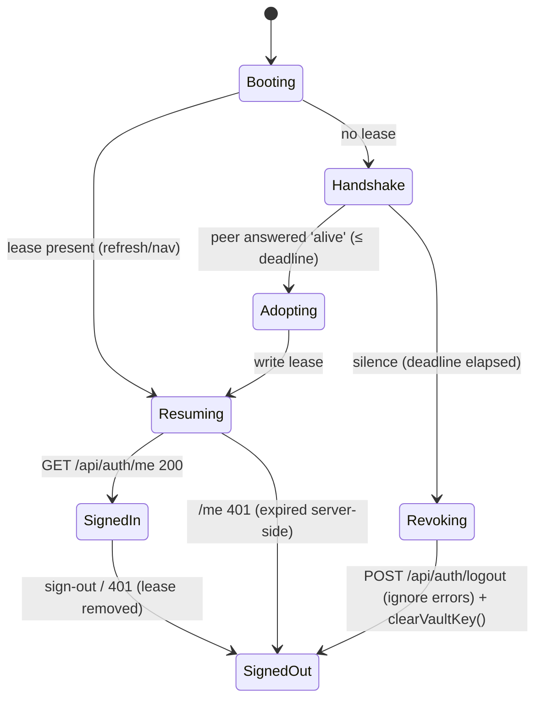

# Data Model: Mobile Single-Scroll Layout & Tab-Scoped Sessions

**Feature**: specs/019-mobile-scroll-tab-session | **Date**: 2026-07-20

This feature changes **no persisted schemas**. The `sessions` collection, `users`
collection, and all shared types are untouched. The "data model" here is the small set
of client-side state that implements the tab lease, plus the one changed cookie
attribute.

## Session (existing — unchanged shape, one new end-of-life trigger)

`sessions` collection ([sessions.service.ts](../../backend/src/services/sessions.service.ts)):

| Field | Type | Notes |
|---|---|---|
| tokenHash | string | SHA-256 of the raw token — unchanged |
| userId | ObjectId | unchanged |
| role | 'admin' \| 'normal' | unchanged |
| createdAt / lastActivityAt | ISO string | unchanged |
| expiresAt | Date (TTL index) | unchanged |

**Lifecycle change (behavioral only)**: a session now ends at the EARLIEST of:
1. explicit sign-out (existing),
2. idle timeout (existing),
3. absolute expiry (existing),
4. **NEW** — next app visit after the last app tab was closed (client-initiated
   revocation via the existing `POST /api/auth/logout`), and
5. **NEW** — full browser close (cookie is now a browser-session cookie; the orphaned
   server record is later swept by the existing TTL index or revoked on next visit).

## Session cookie (changed attribute)

| Attribute | Before | After |
|---|---|---|
| HttpOnly / Secure / SameSite=Lax / Path=/ / Domain | as configured | **unchanged** |
| Max-Age | absolute TTL (86400s) | **omitted** → browser-session cookie (dies on browser close) |

## Tab lease (NEW — client-side, per tab, no secrets)

| Item | Storage | Key / name | Value | Lifetime |
|---|---|---|---|---|
| Lease flag | `sessionStorage` | `vii-pass:tab-lease` | `'1'` | this tab only; survives refresh + in-tab nav; dies with the tab |
| Presence channel | `BroadcastChannel` | `vii-pass:tabs` | messages `{type:'who-is-alive'}` / `{type:'alive'}` | while a tab's SPA is running |

**Invariants**:
- The lease NEVER contains a token, user id, or any secret — it is a pure boolean marker.
- A tab writes the lease only when it legitimately holds the session: after successful
  login/register, or after adopting via handshake, or when booting with a lease already
  present (refresh).
- The lease is removed on explicit sign-out and on 401-driven session loss.
- Only tabs that currently hold the lease AND a signed-in user answer `alive`.

## State transitions (client bootstrap)

## Layout model (CSS only — no data)

| Surface | Scroll owner | Rule |
|---|---|---|
| Vault (signed-in) | `.chord-scroll` ONLY | shell = `100dvh` (fallback `100vh`); page scroller locked; body/page never scrolls |
| Auth pages (login/register/reset) | `.app-main` fallback | unchanged — may page-scroll when the form exceeds a short viewport |
