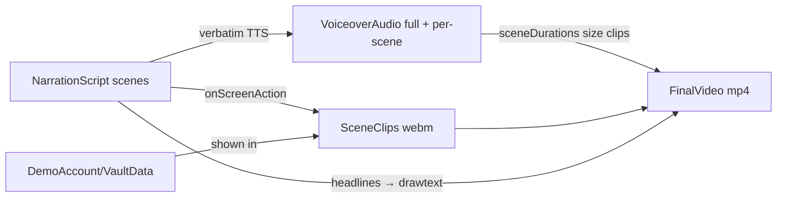

# Data Model: End-to-End Marketing Demo Video

**Feature**: 022-marketing-demo-video | **Date**: 2026-07-22

No database entities — this feature produces media assets. The "data model" is the
asset/scene model that the pipeline scripts and contracts share, plus the demo data set
shown on camera.

## Entities

### NarrationScript (`media/marketing-video/script.md`)

The P1 deliverable and single source of truth. A markdown document containing a scene
table; every downstream asset is derived from it.

| Field | Type | Rules |
|-------|------|-------|
| `sceneId` | string (`S1`…`Sn`) | Sequential, stable — referenced by clips, audio segments, captions |
| `headline` | string ≤ 5 words | The burned-in caption for the scene (FR-011); every scene has exactly one |
| `narration` | string | Spoken text; total across scenes 150–165 words (targets 50–70s at ~155 wpm) |
| `onScreenAction` | string | What the recording shows during this scene (drives `record-demo.mjs`) |
| `covers` | list of coverage tags | Which FR-002 inventory items this scene evidences (narrated, shown, or both) |

**Validation**: union of all `covers` tags == full FR-002 checklist (SC-002); scene
order must be walkable in one continuous app session starting at sign-in (FR-003).

### VoiceoverAudio (`output/voiceover.mp3` + per-scene `output/scenes/S*.mp3`)

| Field | Type | Rules |
|-------|------|-------|
| `fullTrack` | MP3 file | Entire script verbatim (FR-005); measured duration 50–70s (SC-001) |
| `sceneTracks[]` | MP3 files | One per scene; used to size scene clips during assembly |
| `voice` | string | `en-US-AriaNeural` (default; see research D1) |
| `sceneDurations[]` | seconds (ffprobe) | Recorded into assembly config; determines each clip's target length |

**State**: regenerated whenever the script changes (SC-007 cascade: script → audio → re-sync).

### SceneClip (`output/scenes/S*.webm` — git-ignored intermediates)

| Field | Type | Rules |
|-------|------|-------|
| `sceneId` | string | 1:1 with script scenes |
| `layout` | `mobile` \| `desktop-glimpse` | Mobile = 390×844@2x viewport; exactly ONE desktop-glimpse scene (clarification #1) |
| `duration` | seconds | Must be ≥ the scene's narration duration (assembly trims/holds the tail) |
| `content rules` | — | Demo data only (FR-007); no error/loading-failure states (FR-008); viewport-only capture (no browser chrome) |

### FinalVideo (`output/vii-pass-marketing-9x16.mp4`)

| Field | Type | Rules |
|-------|------|-------|
| `resolution` | 1080×1920 (9:16) | Clarified 2026-07-22 |
| `codec` | H.264 (yuv420p) + AAC, `+faststart` | Plays on desktop/browser/mobile without re-encode (FR-009, SC-006) |
| `runtime` | 50–70 s | SC-001 |
| `sync` | ≤1 s drift at any narrated moment | By construction: clip *n* sized to narration segment *n* (SC-005) |
| `captions` | 1 headline per scene, burned in | White text on semi-opaque dark pill (FR-011 legibility) |
| `fileSize` | ≤ ~40 MB | Plan budget; raise CRF if exceeded |

### DemoAccount & DemoVaultData (in `vii_pass_preview` DB — never production)

| Item | Value | Notes |
|------|-------|-------|
| Admin username | `viidemo` | Shown on camera; throwaway |
| View-only username | `viidemoview` | Evidences dual-identity feature |
| Display name | `Alex Morgan` | Fictional |
| Password | `demo123` | Intentionally public; safe to type on camera |
| Security answer | `rex` | For the reset-flow scene (if narrated) |
| Sections | `Work`, `Personal` | Distinct colors → shows color-coded sections + card theming |
| Entries | 4 total (e.g., "Acme Mail", "Bank of Example", "Wi-Fi Home", "Streaming") | All values fake by construction (`example.com`, `Fake!Pass1`-style) — exactly one is revealed on camera |

**Lifecycle**: created once by `seed-demo.mjs` via the real UI (genuine client-side
encryption); may be dropped/re-seeded freely; never migrated.

## Relationships

## Revision cascade (SC-007)

| Change | Must regenerate | Untouched |
|--------|-----------------|-----------|
| Script wording | Audio → video re-assembly | Scene clips (unless actions changed) |
| Audio voice only | Audio → video re-assembly | Script, clips |
| Visual retake | Affected scene clip → video re-assembly | Script, audio |
| Caption text | Video re-assembly only | Script*, audio, clips |

\* headline lives in the script table, so formally a script edit — but it does not
change narration, so audio is NOT regenerated.
